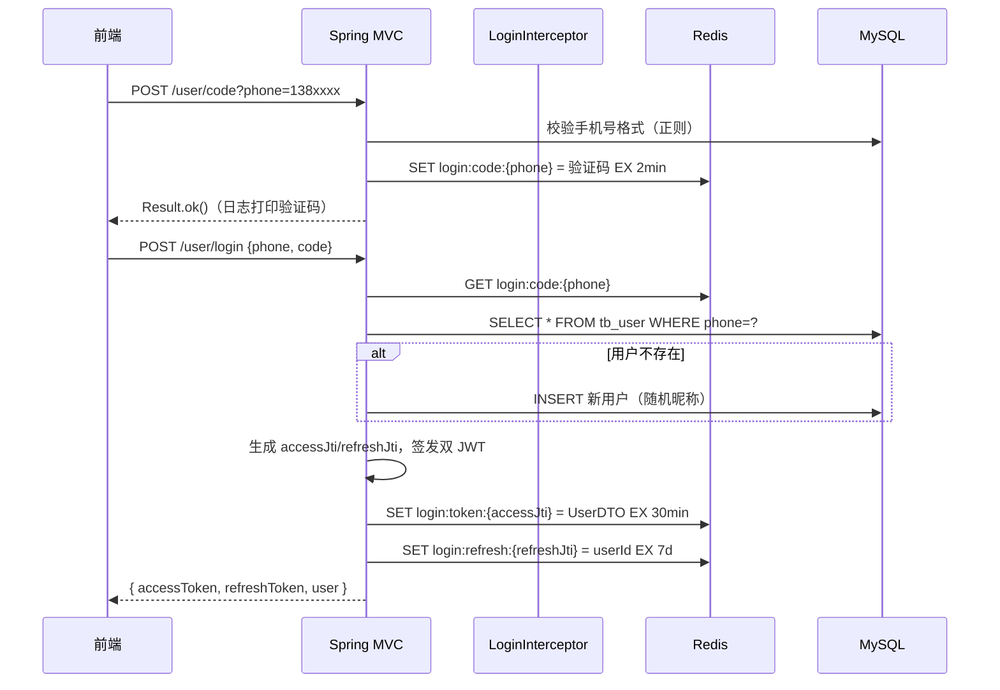
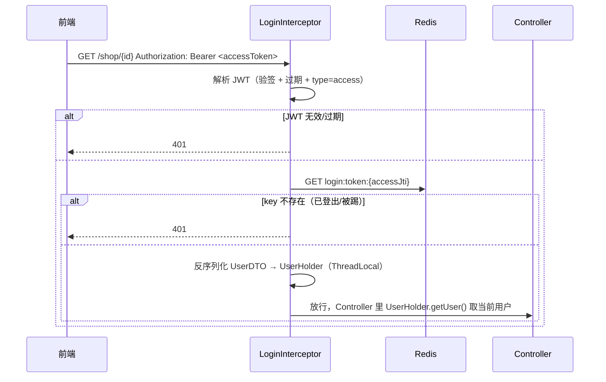

# 企业级 JWT + Redis 登录认证方案（hm-dianping 适配版）

> 技术栈：Spring Boot 2.7.18 / Java 1.8 / javax.*（Java EE 8）/ MyBatis-Plus 3.5.5 / Redis / hutool 5.8.38  
> 适用范围：黑马点评（hm-dianping）学习项目，独立开发者可完整理解并落地

---

## 目录

1. [方案总览](#1-方案总览)
2. [现有项目需修改的文件及修改说明](#2-现有项目需修改的文件及修改说明)
3. [需新增的文件、模块及其职责](#3-需新增的文件模块及其职责)
4. [JWT 令牌的生成、刷新与黑名单机制](#4-jwt-令牌的生成刷新与黑名单机制)
5. [Redis 中 Token 存储结构及过期策略](#5-redis-中-token-存储结构及过期策略)
6. [登录、登出、Token 验证的完整流程](#6-登录登出token-验证的完整流程)
7. [相关配置项说明](#7-相关配置项说明)
8. [落地实施步骤（Checklist）](#8-落地实施步骤checklist)
9. [安全增强建议（进阶）](#9-安全增强建议进阶)

---

## 1. 方案总览

### 1.1 当前项目现状（改造前）

```
浏览器 ── Session ID（Cookie）──>  LoginInterceptor ──> 从 HttpSession 取 userDTO
                                        │
                                        ▼
                                   UserHolder（ThreadLocal）
```

- 登录态存于 **HttpSession**（内存），验证码存于 Session，多实例部署无法共享
- 服务端有状态，天然不支持分布式/微服务扩展

### 1.2 改造后架构

```
浏览器 ── Authorization: Bearer <AccessToken> ──> LoginInterceptor
                                                        │ 1. 验签（JWT 无状态）
                                                        │ 2. 查 Redis 白名单（可主动失效）
                                                        ▼
                                                   UserHolder（ThreadLocal）
                                                        │
                           ┌────────────────────────────┘
                           ▼
                /user/refresh 接口（Access 过期时）
                RefreshToken 换新 AccessToken（7 天免登录）
```

### 1.3 设计核心决策

| 决策点        | 选择                                    | 理由                                             |
| ---------- | ------------------------------------- | ---------------------------------------------- |
| JWT 库      | **hutool 内置 `cn.hutool.jwt.JWTUtil`** | pom 已有 hutool-all 5.8.38，零新增依赖，Java 8 兼容       |
| 令牌模型       | **双 Token（Access + Refresh）**         | 企业主流做法：短期 Access 降低泄漏风险 + 长期 Refresh 保证体验      |
| Token 可撤销性 | **Redis 白名单式**（登录时写入，登出时删除）           | JWT 本身无状态无法撤销，Redis 补上"可主动失效"能力，登出删 key 即等效黑名单 |
| 校验模型       | **验签 + 查 Redis 双重校验**                 | 签名保证防篡改，Redis 保证可撤销                            |
| 拦截器        | **单拦截器**（改造现有 LoginInterceptor）+ 刷新接口 | 结构简单、学习成本低；双拦截器自动续期作为进阶扩展（见 9.3）               |

> **为什么不用纯 JWT（无状态）？**  
> 纯 JWT 验签即通过，服务端无法主动踢人、无法实现"登出立即失效"。企业级系统必须能撤销令牌，因此用 Redis 白名单补齐。JWT 负责"验身"，Redis 负责"记状态"，各司其职。

---

## 2. 现有项目需修改的文件及修改说明

### 2.1 `pom.xml` —— 无需修改 ✅

方案使用 hutool 内置 JWT 工具（`cn.hutool.jwt.JWTUtil`），**不需要新增任何依赖**。若要换 jjwt，见附录 A。

### 2.2 `src/main/resources/application.yaml` —— 新增 JWT 配置段

在文件末尾追加：

```yaml
hmdp:
  jwt:
    secret: "hmdp-jwt-secret-key-please-change-2b5f9c8d4e"   # 签名密钥，至少 32 字节
    access-ttl: 30          # Access Token 有效期（分钟）
    refresh-ttl: 7          # Refresh Token 有效期（天）
    issuer: "hmdp"          # 签发者标识
```

### 2.3 `utils/RedisConstants.java` —— 新增常量

在现有常量基础上追加：

```java
// ===== 登录认证相关 =====
public static final String LOGIN_CODE_KEY = "login:code:";       // 已有：验证码
public static final Long LOGIN_CODE_TTL = 2L;                    // 已有：2 分钟

public static final String LOGIN_USER_KEY = "login:token:";      // 已有：Access 白名单前缀
public static final Long LOGIN_USER_TTL = 30L;                   // 修改：30 分钟（与 Access TTL 一致）

public static final String LOGIN_REFRESH_KEY = "login:refresh:"; // 新增：Refresh 白名单前缀
public static final Long LOGIN_REFRESH_TTL = 7L;                 // 新增：7 天

public static final String LOGIN_BLACKLIST_KEY = "login:blacklist:"; // 新增：黑名单前缀（可选，见 4.4）
```

> 注意：现有 `LOGIN_USER_TTL = 36000L` 是 10 小时的秒数，与课程原版一致。方案改用 **30 分钟**并统一按"分钟"语义管理，代码中显式传 `TimeUnit`，避免单位混淆。

### 2.4 `utils/LoginInterceptor.java` —— 核心改造：Session → JWT + Redis

```java
package com.hmdp.utils;

import cn.hutool.core.util.StrUtil;
import cn.hutool.json.JSONUtil;
import com.hmdp.dto.UserDTO;
import org.springframework.data.redis.core.StringRedisTemplate;
import org.springframework.lang.Nullable;
import org.springframework.stereotype.Component;
import org.springframework.web.servlet.HandlerInterceptor;

import javax.annotation.Resource;
import javax.servlet.http.HttpServletRequest;
import javax.servlet.http.HttpServletResponse;

@Component
public class LoginInterceptor implements HandlerInterceptor {

    @Resource
    private JwtUtils jwtUtils;

    @Resource
    private StringRedisTemplate stringRedisTemplate;

    @Override
    public boolean preHandle(HttpServletRequest request, HttpServletResponse response, Object handler) {
        // 1. 从请求头获取 token（约定 header 名为 authorization，格式 Bearer xxx）
        String token = request.getHeader("authorization");
        if (StrUtil.isBlank(token)) {
            response.setStatus(401);
            return false;
        }
        if (token.startsWith("Bearer ")) {
            token = token.substring(7);
        }
        // 2. 解析并校验 JWT（验签 + 过期 + 类型）
        JwtUtils.JwtPayload payload = jwtUtils.parseAndVerify(token, JwtUtils.TYPE_ACCESS);
        if (payload == null) {
            response.setStatus(401);
            return false;
        }
        // 3. 查 Redis 白名单：key 存在才有效（登出后 key 被删除 → 立即失效）
        String json = stringRedisTemplate.opsForValue().get(RedisConstants.LOGIN_USER_KEY + payload.getJti());
        if (StrUtil.isBlank(json)) {
            response.setStatus(401);
            return false;
        }
        // 4. 反序列化用户并存入 ThreadLocal
        UserDTO userDTO = JSONUtil.toBean(json, UserDTO.class);
        UserHolder.saveUser(userDTO);
        return true;
    }

    @Override
    public void afterCompletion(HttpServletRequest request, HttpServletResponse response, Object handler,
                                @Nullable Exception ex) {
        // 请求结束必须清理 ThreadLocal，防止线程池复用导致数据串号
        UserHolder.removeUser();
    }
}
```

### 2.5 `config/MvConfig.java` —— 放行刷新接口 + 注册新拦截器

```java
package com.hmdp.config;

import com.hmdp.utils.LoginInterceptor;
import org.springframework.beans.factory.annotation.Autowired;
import org.springframework.context.annotation.Configuration;
import org.springframework.web.servlet.config.annotation.InterceptorRegistry;
import org.springframework.web.servlet.config.annotation.WebMvcConfigurer;

@Configuration
public class MvConfig implements WebMvcConfigurer {

    @Autowired
    private LoginInterceptor loginInterceptor;

    @Override
    public void addInterceptors(InterceptorRegistry registry) {
        registry.addInterceptor(loginInterceptor)
                .addPathPatterns("/**")
                .excludePathPatterns(
                        "/user/code",          // 发送验证码
                        "/user/login",         // 登录
                        "/user/refresh",       // 刷新 Token（新增，必须放行！）
                        "/user/info/**",       // 查看用户详情
                        "/shop/**",            // 浏览商铺
                        "/shop-type/**",       // 商铺分类
                        "/voucher/list/**",    // 优惠券列表
                        "/blog/hot"            // 热门博客
                );
    }
}
```

> ⚠️ 关键点：`/user/refresh` 必须加进排除列表，否则 Refresh Token 换 Access Token 的请求会被拦截器 401 拒绝，形成死锁。

### 2.6 `service/impl/UserServiceImpl.java` —— 登录逻辑改为签发双 Token

```java
package com.hmdp.service.impl;

import cn.hutool.core.bean.BeanUtil;
import cn.hutool.core.util.IdUtil;
import cn.hutool.core.util.RandomUtil;
import cn.hutool.json.JSONUtil;
import com.baomidou.mybatisplus.extension.service.impl.ServiceImpl;
import com.hmdp.dto.LoginFormDTO;
import com.hmdp.dto.LoginResultDTO;
import com.hmdp.dto.Result;
import com.hmdp.dto.UserDTO;
import com.hmdp.entity.User;
import com.hmdp.mapper.UserMapper;
import com.hmdp.service.IUserService;
import com.hmdp.utils.JwtUtils;
import com.hmdp.utils.RedisConstants;
import com.hmdp.utils.RegexUtils;
import lombok.extern.slf4j.Slf4j;
import org.springframework.data.redis.core.StringRedisTemplate;
import org.springframework.stereotype.Service;

import javax.annotation.Resource;
import java.util.concurrent.TimeUnit;

import static com.hmdp.utils.SystemConstants.USER_NICK_NAME_PREFIX;

@Slf4j
@Service
public class UserServiceImpl extends ServiceImpl<UserMapper, User> implements IUserService {

    @Resource
    private StringRedisTemplate stringRedisTemplate;

    @Resource
    private JwtUtils jwtUtils;

    /** 发送验证码：Session → Redis */
    @Override
    public Result sendCode(String phone) {
        // 1. 校验手机号
        if (RegexUtils.isPhoneInvalid(phone)) {
            return Result.fail("手机号有误");
        }
        // 2. 生成 6 位随机验证码
        String code = RandomUtil.randomNumbers(6);
        // 3. 存入 Redis，2 分钟有效（验证码必须短 TTL）
        stringRedisTemplate.opsForValue().set(
                RedisConstants.LOGIN_CODE_KEY + phone,
                code,
                RedisConstants.LOGIN_CODE_TTL,
                TimeUnit.MINUTES);
        // 4. 发送（学习项目直接打日志）
        log.info("发送验证码成功，验证码：{}，手机号：{}", code, phone);
        return Result.ok();
    }

    /** 登录：校验验证码 → 查/建用户 → 签发双 Token → 写 Redis 白名单 */
    @Override
    public Result login(LoginFormDTO loginForm) {
        // 1. 校验手机号 + 验证码
        String phone = loginForm.getPhone();
        if (RegexUtils.isPhoneInvalid(phone)) {
            return Result.fail("手机号有误");
        }
        String code = loginForm.getCode();
        String cacheCode = stringRedisTemplate.opsForValue().get(RedisConstants.LOGIN_CODE_KEY + phone);
        if (cacheCode == null || !cacheCode.equals(code)) {
            return Result.fail("验证码错误，请重新获取");
        }
        // 2. 根据手机号查用户，不存在则创建
        User user = query().eq("phone", phone).one();
        if (user == null) {
            user = createNewUser(phone);
        }
        UserDTO userDTO = BeanUtil.copyProperties(user, UserDTO.class);

        // 3. 签发 Access + Refresh 双 Token
        String accessJti = IdUtil.fastSimpleUUID();   // 每个 token 唯一 ID，用于 Redis key
        String refreshJti = IdUtil.fastSimpleUUID();
        String accessToken = jwtUtils.createAccessToken(userDTO.getId(), accessJti);
        String refreshToken = jwtUtils.createRefreshToken(userDTO.getId(), refreshJti);

        // 4. 写 Redis 白名单
        stringRedisTemplate.opsForValue().set(
                RedisConstants.LOGIN_USER_KEY + accessJti,
                JSONUtil.toJsonStr(userDTO),
                RedisConstants.LOGIN_USER_TTL,
                TimeUnit.MINUTES);
        stringRedisTemplate.opsForValue().set(
                RedisConstants.LOGIN_REFRESH_KEY + refreshJti,
                String.valueOf(userDTO.getId()),
                RedisConstants.LOGIN_REFRESH_TTL,
                TimeUnit.DAYS);

        // 5. 返回双 Token + 用户信息
        return Result.ok(new LoginResultDTO(accessToken, refreshToken, userDTO));
    }

    /** 登出：删除 Redis 白名单 = 令牌立即失效（等效黑名单） */
    @Override
    public Result logout(String accessToken, String refreshToken) {
        // 解析并提取 jti，删除对应的白名单 key
        JwtUtils.JwtPayload accessPayload = jwtUtils.parseAndVerify(accessToken, JwtUtils.TYPE_ACCESS);
        JwtUtils.JwtPayload refreshPayload = jwtUtils.parseAndVerify(refreshToken, JwtUtils.TYPE_REFRESH);
        if (accessPayload != null) {
            stringRedisTemplate.delete(RedisConstants.LOGIN_USER_KEY + accessPayload.getJti());
        }
        if (refreshPayload != null) {
            stringRedisTemplate.delete(RedisConstants.LOGIN_REFRESH_KEY + refreshPayload.getJti());
        }
        return Result.ok();
    }

    /** 刷新：Refresh Token 换新双 Token（轮换机制防重放） */
    @Override
    public Result refresh(String refreshToken) {
        // 1. 验签 + 类型校验
        JwtUtils.JwtPayload payload = jwtUtils.parseAndVerify(refreshToken, JwtUtils.TYPE_REFRESH);
        if (payload == null) {
            return Result.fail("刷新令牌无效或已过期，请重新登录");
        }
        // 2. 查 Redis 白名单：被登出/轮换过的 refresh 已删除，此处为 null
        String userIdStr = stringRedisTemplate.opsForValue().get(
                RedisConstants.LOGIN_REFRESH_KEY + payload.getJti());
        if (userIdStr == null) {
            return Result.fail("刷新令牌已失效，请重新登录");
        }
        // 3. 查用户最新信息（昵称/头像可能已变更）
        User user = getById(Long.valueOf(userIdStr));
        if (user == null) {
            return Result.fail("用户不存在");
        }
        UserDTO userDTO = BeanUtil.copyProperties(user, UserDTO.class);

        // 4. 轮换：先删旧 refresh 白名单（防重放——旧 refresh 一次性作废）
        stringRedisTemplate.delete(RedisConstants.LOGIN_REFRESH_KEY + payload.getJti());

        // 5. 签发新双 Token 并写白名单
        String accessJti = IdUtil.fastSimpleUUID();
        String refreshJti = IdUtil.fastSimpleUUID();
        String accessToken = jwtUtils.createAccessToken(userDTO.getId(), accessJti);
        String refreshTokenNew = jwtUtils.createRefreshToken(userDTO.getId(), refreshJti);

        stringRedisTemplate.opsForValue().set(
                RedisConstants.LOGIN_USER_KEY + accessJti,
                JSONUtil.toJsonStr(userDTO),
                RedisConstants.LOGIN_USER_TTL,
                TimeUnit.MINUTES);
        stringRedisTemplate.opsForValue().set(
                RedisConstants.LOGIN_REFRESH_KEY + refreshJti,
                String.valueOf(userDTO.getId()),
                RedisConstants.LOGIN_REFRESH_TTL,
                TimeUnit.DAYS);

        return Result.ok(new LoginResultDTO(accessToken, refreshTokenNew, userDTO));
    }

    private User createNewUser(String phone) {
        User user = new User();
        user.setPhone(phone);
        user.setNickName(USER_NICK_NAME_PREFIX + RandomUtil.randomString(10));
        save(user);
        return user;
    }
}
```

### 2.7 `controller/UserController.java` —— 去掉 Session 参数，补全 logout / 新增 refresh

```java
package com.hmdp.controller;

import com.hmdp.dto.LoginFormDTO;
import com.hmdp.dto.Result;
import com.hmdp.dto.UserDTO;
import com.hmdp.entity.UserInfo;
import com.hmdp.service.IUserInfoService;
import com.hmdp.service.IUserService;
import com.hmdp.utils.UserHolder;
import lombok.extern.slf4j.Slf4j;
import org.springframework.web.bind.annotation.*;

import javax.annotation.Resource;

@Slf4j
@RestController
@RequestMapping("/user")
public class UserController {

    @Resource
    private IUserService userService;

    @Resource
    private IUserInfoService userInfoService;

    /** 发送手机验证码 */
    @PostMapping("code")
    public Result sendCode(@RequestParam("phone") String phone) {
        return userService.sendCode(phone);
    }

    /** 登录：返回 { accessToken, refreshToken, user } */
    @PostMapping("/login")
    public Result login(@RequestBody LoginFormDTO loginForm) {
        return userService.login(loginForm);
    }

    /** 登出：请求头带双 Token，服务端删除白名单 */
    @PostMapping("/logout")
    public Result logout(@RequestHeader("authorization") String accessToken,
                         @RequestHeader("x-refresh-token") String refreshToken) {
        return userService.logout(accessToken, refreshToken);
    }

    /** 刷新 Token：前端检测 401 后调用，用 Refresh Token 换新双 Token */
    @PostMapping("/refresh")
    public Result refresh(@RequestHeader("x-refresh-token") String refreshToken) {
        return userService.refresh(refreshToken);
    }

    /** 获取当前登录用户（拦截器已把用户放入 ThreadLocal） */
    @GetMapping("/me")
    public Result me() {
        UserDTO userDTO = UserHolder.getUser();
        return Result.ok(userDTO);
    }

    @GetMapping("/info/{id}")
    public Result info(@PathVariable("id") Long userId) {
        UserInfo info = userInfoService.getById(userId);
        if (info == null) {
            return Result.ok();
        }
        info.setCreateTime(null);
        info.setUpdateTime(null);
        return Result.ok(info);
    }
}
```

---

## 3. 需新增的文件、模块及其职责

| 文件                    | 包                 | 职责                                         |
| --------------------- | ----------------- | ------------------------------------------ |
| `JwtProperties.java`  | `com.hmdp.config` | 绑定 `hmdp.jwt.*` 配置项（secret、ttl、issuer）     |
| `JwtUtils.java`       | `com.hmdp.utils`  | JWT 生成、解析、验签、过期校验的封装（核心工具）                 |
| `LoginResultDTO.java` | `com.hmdp.dto`    | 登录/刷新响应体：accessToken + refreshToken + user |

### 3.1 `config/JwtProperties.java`

```java
package com.hmdp.config;

import lombok.Data;
import org.springframework.boot.context.properties.ConfigurationProperties;
import org.springframework.stereotype.Component;

/**
 * JWT 配置属性，绑定 application.yaml 中 hmdp.jwt.*
 */
@Data
@Component
@ConfigurationProperties(prefix = "hmdp.jwt")
public class JwtProperties {

    /** 签名密钥：HS256 要求至少 256bit（32 字节），生产中务必使用随机长字符串 */
    private String secret;

    /** Access Token 有效期（分钟） */
    private Long accessTtl;

    /** Refresh Token 有效期（天） */
    private Long refreshTtl;

    /** 签发者 */
    private String issuer;
}
```

### 3.2 `utils/JwtUtils.java`

```java
package com.hmdp.utils;

import cn.hutool.jwt.JWT;
import cn.hutool.jwt.JWTUtil;
import cn.hutool.jwt.JWTValidator;
import com.hmdp.config.JwtProperties;
import lombok.AllArgsConstructor;
import lombok.Data;
import org.springframework.stereotype.Component;

import javax.annotation.Resource;
import java.nio.charset.StandardCharsets;
import java.util.Date;

/**
 * JWT 工具类：基于 hutool 内置 JWT 能力（cn.hutool.jwt），零第三方依赖。
 *
 * 令牌结构（Payload）：
 *   userId —— 用户 ID
 *   jti    —— 令牌唯一 ID（作为 Redis key 后缀，实现"可撤销"）
 *   type   —— access | refresh，防止两种令牌互用
 *   iss    —— 签发者（来自配置）
 *   iat    —— 签发时间
 *   exp    —— 过期时间
 */
@Component
public class JwtUtils {

    public static final String CLAIM_USER_ID = "userId";
    public static final String CLAIM_JTI = "jti";
    public static final String CLAIM_TYPE = "type";
    public static final String TYPE_ACCESS = "access";
    public static final String TYPE_REFRESH = "refresh";

    @Resource
    private JwtProperties jwtProperties;

    /** 解析并校验后的载荷 */
    @Data
    @AllArgsConstructor
    public static class JwtPayload {
        private Long userId;
        private String jti;
    }

    /** 生成 Access Token */
    public String createAccessToken(Long userId, String jti) {
        long ttlMillis = jwtProperties.getAccessTtl() * 60 * 1000L;
        return createToken(userId, jti, TYPE_ACCESS, ttlMillis);
    }

    /** 生成 Refresh Token */
    public String createRefreshToken(Long userId, String jti) {
        long ttlMillis = jwtProperties.getRefreshTtl() * 24 * 60 * 60 * 1000L;
        return createToken(userId, jti, TYPE_REFRESH, ttlMillis);
    }

    private String createToken(Long userId, String jti, String type, long ttlMillis) {
        return JWT.create()
                .setPayload(CLAIM_USER_ID, userId)
                .setPayload(CLAIM_JTI, jti)
                .setPayload(CLAIM_TYPE, type)
                .setPayload("iss", jwtProperties.getIssuer())
                .setIssuedAt(new Date())
                .setExpiresAt(new Date(System.currentTimeMillis() + ttlMillis))
                .setKey(jwtProperties.getSecret().getBytes(StandardCharsets.UTF_8))
                .sign();
    }

    /**
     * 校验令牌：验签 + 过期检查 + 类型检查，全部通过返回载荷，否则返回 null。
     * 注意：此处只做 JWT 自身校验，不查 Redis（Redis 白名单校验由调用方/拦截器负责）。
     */
    public JwtPayload parseAndVerify(String token, String expectedType) {
        try {
            JWT jwt = JWTUtil.parseToken(token);
            // 1. 验签：密钥不一致/被篡改则 verify() 返回 false
            if (!jwt.setKey(jwtProperties.getSecret().getBytes(StandardCharsets.UTF_8)).verify()) {
                return null;
            }
            // 2. 过期校验：exp 已过则抛异常
            JWTValidator.of(jwt).validateDate();
            // 3. 类型校验：access 令牌不能当 refresh 用，反之亦然
            String type = jwt.getPayload(CLAIM_TYPE).toString();
            if (!expectedType.equals(type)) {
                return null;
            }
            Long userId = Long.valueOf(jwt.getPayload(CLAIM_USER_ID).toString());
            String jti = jwt.getPayload(CLAIM_JTI).toString();
            return new JwtPayload(userId, jti);
        } catch (Exception e) {
            // 解析失败 / 验签失败 / 过期 / 类型不符，统一返回 null
            return null;
        }
    }
}
```

### 3.3 `dto/LoginResultDTO.java`

```java
package com.hmdp.dto;

import lombok.AllArgsConstructor;
import lombok.Data;
import lombok.NoArgsConstructor;

/**
 * 登录 / 刷新接口的响应体
 */
@Data
@NoArgsConstructor
@AllArgsConstructor
public class LoginResultDTO {
    private String accessToken;
    private String refreshToken;
    private UserDTO user;
}
```

---

## 4. JWT 令牌的生成、刷新与黑名单机制

### 4.1 令牌设计

| 属性   | Access Token                         | Refresh Token                               |
| ---- | ------------------------------------ | ------------------------------------------- |
| 生命周期 | **30 分钟**（短）                         | **7 天**（长）                                  |
| 携带方式 | 每次请求 `Authorization: Bearer <token>` | 仅刷新时携带 `x-refresh-token`                    |
| 存储位置 | Redis 白名单 + 前端内存                     | Redis 白名单 + 前端（localStorage/sessionStorage） |
| 丢失风险 | 短，30 分钟即失效                           | 长，需要轮换 + 白名单双重保护                            |
| 用途   | 访问受保护接口                              | 换取新的 Access Token（无感续期）                     |

**为什么分两个令牌？**

- 如果只有长 Token：一旦泄漏，攻击者可以在很长一段时间内冒用，服务端还无法撤销（除非查 Redis）
- Access 短 + Refresh 长：Access 泄漏危害被限制在 30 分钟内；Refresh 虽长，但配合**轮换机制**（每次使用即作废）和 Redis 白名单，可随时吊销

### 4.2 JWT 生成（签发）

```
登录成功
   │
   ├─ 生成 accessJti = UUID（唯一）
   ├─ 生成 refreshJti = UUID（唯一）
   │
   ├─ AccessToken = HS256(header.payload{userId, jti, type=access, iss, iat, exp=now+30min}, secret)
   ├─ RefreshToken = HS256(header.payload{userId, jti, type=refresh, iss, iat, exp=now+7d}, secret)
   │
   ├─ Redis SET login:token:{accessJti} = UserDTO(JSON)  EX 30min
   └─ Redis SET login:refresh:{refreshJti} = userId       EX 7d
```

**关键点**：

- `jti` 是每个令牌的唯一 ID，它是 **JWT 无状态能力和 Redis 有状态能力之间的桥**——通过 jti 就能在 Redis 里精确操作某一个令牌
- 签名算法 HS256，密钥必须 ≥ 32 字节（256bit），否则 hutool 会拒绝或签名不安全
- Payload 只放 `userId`，**绝不放手机号、密码等敏感信息**（JWT 只做 Base64 编码，不加密）

### 4.3 令牌刷新（续期）

```
前端：收到 401（Access 过期/无效）
   │
   └─ POST /user/refresh   header: x-refresh-token=<refreshToken>
        │
        ├─ 1. 验签 + 类型(type=refresh) + 过期校验 ──失败──> 401 重新登录
        ├─ 2. 查 Redis: login:refresh:{refreshJti} 存在？──不存在──> 401 重新登录
        │
        ├─ 3. 删除旧 refresh 白名单 ←──── 轮换机制（旧 Refresh 一次性作废，防重放）
        ├─ 4. 生成全新双 Token（新 jti）
        ├─ 5. 写新白名单
        └─ 6. 返回 { accessToken, refreshToken, user }
```

**为什么轮换 Refresh Token？**  
假设 Refresh Token 被攻击者窃取，同时使用旧 Token 的用户和攻击者：

- 不轮换：两个人都能用，无法察觉
- 轮换（每次刷新作废旧 Token）：第一次刷新后旧 Token 作废，若攻击者再用旧 Token 刷新，会被拒——**能检测并切断被盗会话**

### 4.4 黑名单机制

本方案采用**白名单式管理**，登出/失效 = 删除白名单 key，等效于"加入黑名单"：

```
登出流程：
   删除 login:token:{accessJti}    → Access Token 立即失效
   删除 login:refresh:{refreshJti} → Refresh Token 立即失效

效果：即使 JWT 本身还有效（未到 exp），任何携带它的请求都会被拦截器 401 拒绝。
```

**备选：显式黑名单（纯 JWT 无状态场景）**

如果不想把用户信息存 Redis（某些高并发场景想省一次 Redis 读），可以只做"黑名单"：

```
登出流程：
   SET login:blacklist:{jti} = 1  EX <token剩余秒数>
   拦截器：验签通过后，先查 blacklist:{jti}，存在 → 401

缺点：token 剩余有效期越长，黑名单条目存活越久，Redis 里"垃圾"越多；
      且需要额外一次 Redis 查询。学习项目推荐白名单式，逻辑更直观。
```

**对比总结**：

|           | 白名单式（本方案）       | 黑名单式（备选）                  |
| --------- | --------------- | ------------------------- |
| Redis 存什么 | 有效 Token 的用户信息  | 已吊销 Token 的 jti           |
| 拦截器校验     | 查 key 存在 → 放行   | 查 key 不存在 → 放行            |
| 登出实现      | 删 key           | 写 key                     |
| 优点        | 可主动踢人、天然携带用户信息  | 请求时可减少一次 Redis 读（仅登出后受影响） |
| 缺点        | 每次请求多一次 Redis 读 | 黑名单积压、无法主动踢人（严格说可以踢但实现繁琐） |


---

## 5. Redis 中 Token 存储结构及过期策略

### 5.1 Key 设计总表

| Redis Key                    | 类型     | Value          | TTL                   | 用途                   |
| ---------------------------- | ------ | -------------- | --------------------- | -------------------- |
| `login:code:{phone}`         | String | 6 位验证码         | **2 分钟**              | 登录验证码（防暴力枚举）         |
| `login:token:{accessJti}`    | String | UserDTO 的 JSON | **30 分钟**（Access 有效期） | Access 白名单：存在 = 已登录  |
| `login:refresh:{refreshJti}` | String | userId         | **7 天**（Refresh 有效期）  | Refresh 白名单：存在 = 可刷新 |
| `login:blacklist:{jti}`      | String | `1`            | 令牌剩余时间（可选）            | 显式黑名单（备选方案）          |

### 5.2 为什么 TTL 与 Token 有效期保持一致？

- `login:token:{jti}` 的 TTL = Access Token 的剩余有效期（30 分钟）：**两个生命周期天然同步**，Token 过期时 Redis key 也自动消失，无需手动清理
- `login:refresh:{jti}` 同理（7 天）
- 验证码 2 分钟：短 TTL 是验证码的标准安全实践，防止验证码长期有效被暴力尝试

### 5.3 过期策略说明

- **被动过期**：Redis 在 key 被访问时惰性检查 TTL，TTL 到了且被访问则删除
- **主动过期**：Redis 每 100ms 随机抽样检查过期 key 并删除（默认 `activeExpireCycle`）
- **不需要定时任务**：所有登录相关 key 都带 TTL，Redis 自动回收，应用层零维护

### 5.4 多端登录说明

本方案 jti 随机生成，**天然支持多端登录**（手机 + 电脑可同时在线，各持有自己的双 Token）。

若业务要求**单点登录**（新登录踢掉旧会话），做法：白名单 key 改为 `login:user:{userId}`（用 userId 代替 jti 做 key），新登录覆盖旧值即可。两种模式互斥，按业务选一。

---

## 6. 登录、登出、Token 验证的完整流程

### 6.1 登录流程（时序）



### 6.2 Token 验证流程（每次请求）



### 6.3 登出流程

```
前端点击退出
   │
   └─ POST /user/logout
        header: Authorization: Bearer <accessToken>
                x-refresh-token: <refreshToken>
        │
        ├─ 解析 access → 删除 login:token:{accessJti}
        ├─ 解析 refresh → 删除 login:refresh:{refreshJti}
        └─ 前端清除本地 token → 完成
```

### 6.4 刷新流程

```
前端：收到 401（且确认是"已登录但 Access 过期"）
   │
   └─ POST /user/refresh
        header: x-refresh-token: <refreshToken>
        │
        ├─ 验签 refresh + 查白名单 → 失败返回 401（前端跳登录页）
        ├─ 删除旧 refresh 白名单（轮换）
        ├─ 签发新双 Token + 写新白名单
        └─ 返回新 { accessToken, refreshToken, user }
           → 前端用新 Access Token 重放原请求
```

### 6.5 前端约定（后端视角）

| Header                                | 何时带    | 说明                 |
| ------------------------------------- | ------ | ------------------ |
| `Authorization: Bearer <accessToken>` | 每次请求   | 标准 Bearer 格式       |
| `x-refresh-token: <refreshToken>`     | 刷新、登出时 | 自定义头，避免与 Access 混用 |

---

## 7. 相关配置项说明

### 7.1 `application.yaml` 新增配置

```yaml
hmdp:
  jwt:
    secret: "hmdp-jwt-secret-key-please-change-2b5f9c8d4e"   # 签名密钥
    access-ttl: 30          # Access Token 有效期（分钟）
    refresh-ttl: 7          # Refresh Token 有效期（天）
    issuer: "hmdp"          # 签发者
```

| 配置项                    | 类型     | 默认值   | 说明                                                                   |
| ---------------------- | ------ | ----- | -------------------------------------------------------------------- |
| `hmdp.jwt.secret`      | String | 无（必填） | JWT 签名密钥。**HS256 要求 ≥ 32 字节**；生产环境必须用随机长字符串，并放入环境变量/配置中心，绝不能硬编码进代码仓库 |
| `hmdp.jwt.access-ttl`  | Long   | 30    | Access Token 有效期（分钟）。建议 15~60，越短越安全，越长体验越好                           |
| `hmdp.jwt.refresh-ttl` | Long   | 7     | Refresh Token 有效期（天）。建议 7~30，取决于业务对"记住登录"的要求                         |
| `hmdp.jwt.issuer`      | String | hmdp  | 签发者标识，用于多服务间区分令牌来源                                                   |

### 7.2 现有配置的配合项

| 配置项                                    | 当前值                          | 说明                                        |
| -------------------------------------- | ---------------------------- | ----------------------------------------- |
| `spring.redis.host/port/password`      | 192.168.90.128:6379 / 123456 | Redis 连接。开发期可用本地 Redis（localhost:6379 免密） |
| `spring.redis.lettuce.pool.max-active` | 10                           | 连接池上限。登录验证码 + 白名单都属于高频 Redis 操作，10 足够学习场景 |
| `server.port`                          | 8081                         | 应用端口                                      |

### 7.3 密钥管理最佳实践（生产）

```
# 方式一：环境变量（推荐，简单）
HMDP_JWT_SECRET="$(openssl rand -base64 48)"   # 生成随机密钥
export HMDP_JWT_SECRET

# 方式二：Spring 属性占位符（读环境变量）
hmdp:
  jwt:
    secret: ${HMDP_JWT_SECRET}
```

---

## 8. 落地实施步骤（Checklist）

按依赖顺序实施，每步可独立编译验证：

- [ ] **Step 1：新增配置类** `JwtProperties.java`（3.1）→ 编译
- [ ] **Step 2：新增工具类** `JwtUtils.java`（3.2）→ 编译
- [ ] **Step 3：新增 DTO** `LoginResultDTO.java`（3.3）→ 编译
- [ ] **Step 4：修改** `RedisConstants.java`（2.3）→ 编译
- [ ] **Step 5：修改** `application.yaml`（2.2）→ 启动无报错
- [ ] **Step 6：改造** `UserServiceImpl.java`（2.6）→ 编译（去掉 HttpSession 依赖）
- [ ] **Step 7：改造** `UserController.java`（2.7）→ 编译
- [ ] **Step 8：改造** `LoginInterceptor.java`（2.4）→ 编译
- [ ] **Step 9：修改** `MvConfig.java`（2.5）放行 `/user/refresh` → 编译
- [ ] **Step 10：全量验证**
  ```bash
  mvn clean compile            # 编译通过
  mvn spring-boot:run          # 或 IDEA 运行 HmDianPingApplication
  ```
- [ ] **Step 11：接口自测**（curl 或 Apifox/Postman）
  ```bash
  # 1. 发验证码（日志看验证码）
  curl -X POST "http://localhost:8081/user/code?phone=13800000000"

  # 2. 登录（拿返回的 accessToken / refreshToken）
  curl -X POST "http://localhost:8081/user/login" \
       -H "Content-Type: application/json" \
       -d '{"phone":"13800000000","code":"<日志里的验证码>"}'

  # 3. 带 Token 访问受保护接口
  curl "http://localhost:8081/user/me" \
       -H "Authorization: Bearer <accessToken>"

  # 4. 刷新 Token
  curl -X POST "http://localhost:8081/user/refresh" \
       -H "x-refresh-token: <refreshToken>"

  # 5. 登出（之后再用旧 accessToken 访问应 401）
  curl -X POST "http://localhost:8081/user/logout" \
       -H "Authorization: Bearer <accessToken>" \
       -H "x-refresh-token: <refreshToken>"
  ```

---

## 9. 安全增强建议（进阶）

### 9.1 登录接口防暴力（验证码失败计数）

```
key: login:fail:{phone}
每次验证码校验失败：INCR login:fail:{phone}
TTL：10 分钟
若计数 ≥ 5：拒绝登录 30 分钟（SET login:block:{phone} = 1 EX 30min）
```

### 9.2 Token 泄漏检测（轮换告警）

在 `refresh()` 中：若 `login:refresh:{jti}` 不存在但 JWT 验签通过，说明该 Refresh Token 已被使用过（正常轮换）或被登出。可以在此处记录日志/告警——**旧 Token 被再次使用 = 疑似被盗**。

### 9.3 双拦截器自动续期（进阶版，可选）

黑马课程进阶版用两个拦截器实现"后端无感续期"：

- `RefreshTokenInterceptor`（order=0，拦截所有路径）：解析 Token → 查 Redis → 命中则刷新 TTL（滑动过期）→ 存入 ThreadLocal
- `LoginInterceptor`（order=1，只拦需登录路径）：从 ThreadLocal 取用户，为空则 401

```java
// RefreshTokenInterceptor 核心片段
@Override
public boolean preHandle(...) {
    String token = request.getHeader("authorization");
    if (StrUtil.isNotBlank(token)) {
        // 解析 + 查白名单 + 命中后：
        stringRedisTemplate.expire(key, RedisConstants.LOGIN_USER_TTL, TimeUnit.MINUTES); // 滑动续期
        UserHolder.saveUser(userDTO);
    }
    return true; // 放行，让 LoginInterceptor 决定是否拦
}
```

**对比**：本方案（刷新接口模式）是 SPA 前后端分离的业界主流；双拦截器模式对前端更透明但增加一次 Redis 写（续期）。学习阶段先掌握本方案即可。

### 9.4 密码登录扩展

当前 `LoginFormDTO` 已预留 `password` 字段。扩展密码登录：

- 注册时用 BCrypt（spring-security-crypto 的 `BCryptPasswordEncoder`，Spring Boot 内置）加密存储到 `tb_user.password`
- 登录时校验密码 → 走同一套双 Token 签发逻辑
- 手机验证码登录与密码登录可共存（登录接口按参数区分）

### 9.5 HTTPS

生产环境强制 HTTPS，否则 Token 在传输中明文暴露，一切 JWT 安全设计归零。

---

## 附录 A：使用 jjwt 库的备选方案

hutool 内置 JWT 已满足需求。若团队规范要求使用标准 jjwt（`io.jsonwebtoken`）：

```xml

<dependency>
    <groupId>io.jsonwebtoken</groupId>
    <artifactId>jjwt-api</artifactId>
    <version>0.11.5</version>
</dependency>
<dependency>
    <groupId>io.jsonwebtoken</groupId>
    <artifactId>jjwt-impl</artifactId>
    <version>0.11.5</version>
    <scope>runtime</scope>
</dependency>
<dependency>
    <groupId>io.jsonwebtoken</groupId>
    <artifactId>jjwt-jackson</artifactId>
    <version>0.11.5</version>
    <scope>runtime</scope>
</dependency>
```

jjwt 0.11.5 兼容 Java 8，API 风格为链式 Builder。JwtUtils 内部实现替换即可，**其余代码（拦截器、Service、Redis 结构）完全不变**——这是把 JWT 能力封装进 `JwtUtils` 的好处。

---

## 附录 B：方案演进路径（对照课程）

| 阶段        | 认证方案                                          | 状态           |
| --------- | --------------------------------------------- | ------------ |
| 课程前半段（当前） | Session + Cookie                              | 本次改造前        |
| **本次方案**  | **JWT + Redis 双 Token 白名单**                   | **本次落地**     |
| 进阶        | 双拦截器自动续期 / Spring Security + JWT              | 见 9.3 / 后续课程 |
| 生产级       | OAuth2 / Spring Authorization Server + 网关统一鉴权 | 多服务拆分后       |

---

*文档生成于 2026-08-11，基于当前 hm-dianping 项目实际代码（Spring Boot 2.7.18 / Java 1.8 / MyBatis-Plus 3.5.5 / hutool 5.8.38 / javax.*）编写，所有类名、方法名、包路径均与项目源码对齐。*
